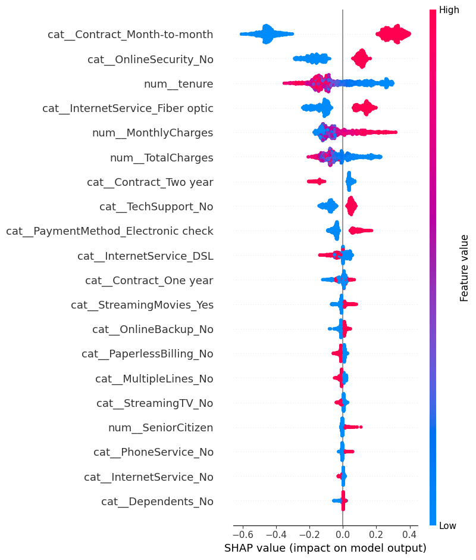

# Telco Customer Churn Prediction

## Project Summary

Customer churn is one of the most important challenges for subscription-based businesses. Acquiring a new customer is usually more expensive than retaining an existing one, which makes early churn detection valuable.

In this project, I developed a machine learning model to identify customers who are likely to leave a telecom provider. The goal was not only to generate accurate predictions, but also to understand the main factors influencing churn so those insights can support retention strategies.

---

## Main Objectives

* Predict whether a customer will churn
* Reduce missed churn cases (false negatives)
* Understand the variables most associated with churn
* Translate model outputs into business actions

---

## Dataset & Preparation

The dataset contains customer demographic information, account details, billing variables, subscribed services, and churn status.

Steps completed before modeling:

* Treated missing values in `TotalCharges`
* Converted categorical variables into numerical format
* Split data into train and test sets using stratification
* Reviewed class imbalance in the target variable

---

## Modeling Process

I tested multiple approaches to compare predictive performance and interpretability.

### Logistic Regression

Used as a baseline model due to its simplicity and transparency.

**Results**

* ROC-AUC around 0.83
* Stable overall performance
* Lower recall for churn customers

### Decision Tree

Included to capture non-linear patterns and interaction effects.

**Results**

* Better churn recall than logistic regression
* Easier to visualize decisions
* More prone to overfitting

### XGBoost (Selected Model)

The final model was XGBoost because it delivered the best balance between recall and ranking performance.

**Why it performed better**

* Handles complex relationships well
* Includes regularization
* Works effectively with imbalanced data
* Strong performance after tuning

---

## Model Tuning

To improve results, I applied:

* `RandomizedSearchCV` for hyperparameter optimization
* `StratifiedKFold` cross-validation
* Threshold tuning to prioritize churn detection

One important takeaway from this phase was that model quality depends not only on probabilities, but also on the threshold used to classify customers as churners.

---

## Final Performance

**Selected Model: XGBoost**

* ROC-AUC: ~0.84
* Recall (Churn Class): ~0.78
* Significant reduction in false negatives compared with the baseline model

### Business Trade-off

Increasing recall helps identify more at-risk customers, but it can also generate more false positives. In practice, the best threshold depends on the cost of retention campaigns versus the cost of losing a customer.

---

## Explainability with SHAP

To make the model easier to interpret, I used SHAP values.

### Main Drivers of Churn

* Customers with **low tenure** were more likely to churn
* **Month-to-month contracts** showed higher churn risk
* Higher **monthly charges** increased churn probability
* Customers with additional services were less likely to leave

### SHAP Visualization

---

## Business Recommendations

Based on the results, a telecom company could consider:

* Strengthening onboarding programs for new customers
* Promoting annual or multi-year contracts
* Reviewing pricing strategies for high-charge segments
* Bundling additional services to increase retention

---

## What I Learned

This project reinforced several practical lessons:

* Class imbalance can distort model performance if ignored
* Recall can be more valuable than accuracy in churn problems
* Threshold selection is a business decision, not only a technical one
* Explainability helps convert models into actionable tools

---

## Possible Next Steps

* Compare results with SMOTE or other resampling methods
* Deploy the model through an API
* Create a dashboard for churn monitoring
* Retrain periodically with updated customer data

---

## Tools Used

* Python
* Pandas
* NumPy
* Scikit-learn
* XGBoost
* SHAP

---

## Contact

If you'd like to discuss the project, exchange ideas, or collaborate, feel free to connect with me.
